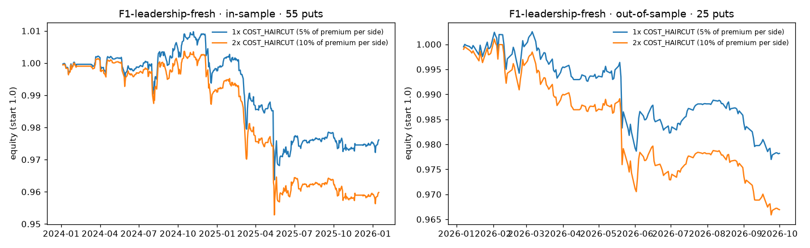

# Fresh Leadership 8-Ks Are Under-Priced, Not Over-Priced

Gator Quant Hacks 2026 · Systematic Trading track · Massive "Trade the 8-K" bonus. Rule frozen at git tag `freeze-v2`;
pre-registration in `runs/PREREG.md`; every number below is reproduced by the notebook (section 12), `harness.py` and
`report_extras.py` (see `runs/REPRO.md`). Supporting tables: `runs/EXTRAS.md`, `runs/APPENDIX.md`.

**Summary.** We pre-registered that *fresh* leadership 8-Ks (the filing is the first disclosure) over-price the move, so
selling a cash-secured put after them beats ordinary days. It is **rejected, in the opposite direction**: after fresh
filings the put-seller did worse than on ordinary days in-sample (−1.19%, n=55) and out-of-sample (−0.70%, n=25), and
the sign is negative in all 18 parameter neighbours in both windows. The evidence fits the market **under-pricing fresh
leadership shocks**. That reframe was written after both windows were seen, so we register it as a sealed-window prediction
rather than claim it. Stale filings show no stable edge.

## 1. Hypothesis and who is on the other side

**Pre-registered (before any P&L).** Leadership-change 8-Ks over-price the move only when the 8-K is the first public
disclosure. Holders surprised by a governance shock over-pay for protection right after it; when the 8-K follows a press
release by days, the chain has already re-priced. Prediction: a cash-secured put entered at the post-filing close beats
ordinary days on fresh filings, but not on stale ones. Failure: fresh and stale earn the same.

**Who was on the other side.** Our put was sold to the holders buying protection after the shock. The results say they
were right to pay: fresh-event stocks fell more than on ordinary days and moved more than the chain priced (section 4).
The price-setter we expected to over-charge, under-charged. We do not know yet why that persists; the sealed window is the test.

## 2. Data and method

- **Universe:** the notebook's static list of the 100 largest US companies as of September 2026 (see limitations).
- **Events:** Massive Filings & Disclosures tags `ceo_appointment`, `ceo_departure`, `cfo_appointment`, `cfo_departure`,
  `executive_officer_appointment`; one event per ticker and filing session. Found: in-sample 62 fresh / 108 stale;
  out-of-sample 27 fresh / 42 stale (fewer are priced, because some have no tradeable chain).
- **Freshness:** lag = trading sessions from the 8-K's `CONFORMED PERIOD OF REPORT` (EDGAR submission header, the
  "date of earliest event reported") to the filing session. Fresh if lag ≤ 1. Undated: 0%.
- **Timing (no lookahead):** filings accepted after 16:00 ET (EDGAR acceptance timestamp) move to the next session.
  Entry is the close of that session, using only the chain as it stood then.
- **Instrument:** Massive options contracts and daily aggregates; 3-6 month expiry, put 5% below spot, marked at h=21, h=42
  and expiry (the portfolio in section 5 holds 21 sessions);
  the stock leg, where a strategy needs one, is the synthetic stock from the ATM pair (the starter notebook's method).
- **Control:** ordinary days for the same tickers (the notebook's placebo, 120 draws per window, ≥30 days from any event).
  The edge is events minus ordinary days, averaged over h=21, h=42 and expiry, with 95% bootstrap intervals.
- **Windows:** in-sample 2024-01-01 to 2025-12-31; out-of-sample 2026-01-01 to 2026-08-31, looked at once. The judges'
  sealed window replaces the track's 20% holdout (Massive bonus rule).
- **Data handling:** a leg's mark must be at most 3 sessions old, otherwise that session is missing (never filled from
  later data); non-standard (post-split) contracts are dropped; option prices are unadjusted.

## 3. Results

| Window | Comparison | n | Edge | 95% CI | Gate verdict |
|---|---|---|---|---|---|
| In-sample | Fresh vs ordinary days | 55 | −1.19% | excludes 0 at 1 of 3 horizons | worse; survives dropping best 3 (−0.45%) |
| In-sample | Stale vs ordinary days | 95 | −0.16% | includes 0 | not supported |
| In-sample | Fresh − stale | 55 | −1.03% | includes 0 | not supported |
| Out-of-sample | Fresh vs ordinary days | 25 | −0.70% | includes 0 at all 3 | **same sign as in-sample** |
| Out-of-sample | Stale vs ordinary days | 40 | +2.13% | excludes 0 at 2 of 3 | sign flipped vs in-sample: not a finding |
| Out-of-sample | Fresh − stale | 25 | −2.82% | excludes 0 at 2 of 3 | fails gate 1 (not significant in-sample); same sign |

By lag, in-sample the most recent filings did worst (lag 0: −1.78%, n=17; lag 1: −0.93%, n=38), but the pattern is not
monotonic beyond that (appendix A1).

## 4. Robustness: does it survive its neighbours, years, and the simple explanation?

**Parameter sensitivity** (fresh vs ordinary days, post entry; full table with pre entry in `runs/EXTRAS.md`).
The edge is below zero in **18 of 18 cells (bucket × OTM × entry) in both windows**: a plateau, not a peak.

| Bucket | In-sample 3% / 5% / 10% OTM | Out-of-sample 3% / 5% / 10% OTM |
|---|---|---|
| 1m | −0.65% / −0.12% / −1.05%* | −0.90% / −0.23% / −0.10% |
| 2m | −1.25% / −1.30% / −1.30%* | −2.06% / −2.05% / −1.41%* |
| 3-6m | −1.32% / −1.19%* / −1.03% | −0.25% / −0.70% / −0.27%* |

\* the 95% CI excludes zero at one or more horizons.

**By year.** Fresh vs ordinary days: 2024 −0.70% (n=27), 2025 −1.61% (n=32), 2026 out-of-sample −0.70% (n=27).
No single year carries the result.

**Direction vs size.** Two things went wrong for the put-seller, in both windows: fresh-event stocks fell more than on
ordinary days (own-stock move edge −1.32% in-sample, −1.36% out-of-sample), and they moved more than the chain priced
(median |realized| ÷ implied move 1.08 vs 0.75 on ordinary days in-sample; 0.82 vs 0.65 out-of-sample). The mean ratio
by horizon is higher for fresh than stale at all four horizons in-sample but only two of four out-of-sample
(notebook section 12, exploratory). We cannot separate the stock's own move from the market's (the challenge has no
index data), so part of the direction effect may be market beta.

## 5. Portfolio performance (one put per fresh event on 1/10 of capital, held 21 sessions)

| Window | Costs | n | Ann. return | Ann. vol | Sharpe | Max DD | Skew | Worst month | Turnover | Worst event |
|---|---|---|---|---|---|---|---|---|---|---|
| In-sample | 1× | 55 | −1.2% | 2.1% | −0.57 | −4.6% | −2.26 | −1.51% | 2.7×/yr | −16.5% |
| In-sample | 2× | 55 | −2.0% | 2.1% | −0.97 | −5.1% | −2.30 | −1.62% | 2.7×/yr | −16.9% |
| Out-of-sample | 1× | 25 | −3.0% | 2.3% | −1.31 | −2.5% | −1.89 | −1.11% | 3.4×/yr | −10.1% |
| Out-of-sample | 2× | 25 | −4.6% | 2.3% | −1.98 | −3.5% | −1.84 | −1.27% | 3.4×/yr | −11.2% |

By year (1× costs): in-sample 2024 −0.24%, 2025 −2.25%;
out-of-sample 2026 −2.18%. **Costs:** there are no quotes in the data, so we charge 5% of the put's premium per side (the
notebook's assumption), which is a median of 13 bps of notional per side in-sample (interquartile 10-18) and 18 bps
out-of-sample (15-26). 2× doubles it. The strategy loses before costs; costs only deepen it. Negative skew is the
short-volatility tail the track warns about.

## 6. Risk management plan

Sizing is fixed at 1/10 of capital per event, cash-secured (collateral = strike × 100), with at most 10 open positions;
the backtest peaked at 7 (in-sample) and 8 (out-of-sample), so it never ran uncollateralized. The measured risks are a
worst single event of −16.5% per $1 notional (−1.65% of capital at 1/10 sizing), a worst month of −1.51%, and a maximum
drawdown of −4.6%. Assignment is covered by the cash collateral; early assignment and dividends are not modelled.
Because a short put is long the stock, a market-wide selloff hits every open position at once; with 7-8 concurrent
positions, that is the main tail risk, and we could not measure market beta without index data. The finding itself says
the opposite trade, buying protection, is where the evidence points; for the original trade the risk plan is simply
**do not run it after fresh leadership filings**.

## 7. Liquidity and capacity

Measured from the sold put's own volume over the 10 calendar days before entry: median 29 contracts per session
in-sample (18 out-of-sample). One position at 1% of that volume carries about $5k of notional (median; $2k at the 25th
percentile), and at 10% about $50k ($19k). Ten concurrent positions at 10% participation therefore cap the strategy at
roughly $0.5M in-sample (about $0.4M out-of-sample). **This is a research finding, not a scalable strategy**; the
5%-OTM, 3-6 month puts on these names are thinly traded.

## 8. How many things we tried

24 in-sample comparisons are logged in `runs/ledger.jsonl` across 6 pairings: four earlier pairings (three JEV-based
leadership pairings and a good-news long call) were null, an earnings pairing passed in-sample and failed out-of-sample
(appendix A3), and the rest are F1's arms and lag buckets.
At this count a few starred horizons are expected by chance. Only one result held its sign out-of-sample: fresh worse
than ordinary days. Two out-of-sample looks were taken in total (B6-earnings and F1), each once.

## 9. Sealed-window predictions (written after the out-of-sample look, before the sealed window)

1. Fresh cash-secured put below ordinary days (negative edge).
2. Fresh − stale negative.
3. With about 3 months of data (likely under 20 fresh events), both intervals include zero: the sign is the prediction.
4. A prediction only, not tested: a protective put after fresh filings beats ordinary days.

## 10. Limitations

1. **Survivorship and look-ahead in the universe:** the top 100 is the September 2026 list applied to 2024-2026. Firms that
   grew into it are included and firms that dropped out are not. We cannot estimate the effect without point-in-time
   membership; it changes which events are included, not how each is priced.
2. **Event date:** the period of report is when the event happened, which can precede the public announcement. That mixes
   the fresh and stale arms, which can hide a difference but not create one.
3. **Costs are assumed,** not measured from quotes; the 2× check is how we bound that.
4. **Corporate actions:** option prices are unadjusted; the synthetic stock ignores dividends and early assignment, which
   matters for the stock-holding strategies, not for the cash-secured put tested here.
5. **Small samples,** especially out-of-sample (25 fresh events): only the sign replicated, not significance.
6. **No earnings calendar,** so some events share their window with an earnings release.
7. **The reframe ("under-priced") is post-hoc.** It is supported by the in-sample move ratios and the sign of every
   cell, but only the sealed window can confirm it.

## Conclusion

The pre-registered hypothesis is rejected, and the rejection replicated in sign: do not sell protection after fresh
leadership 8-Ks. The broader claim, that the market under-prices fresh governance shocks, is consistent with the results
but not proven. It is the prediction we hand to the sealed window, and the next experiment (`runs/PREREG_VRP.md`: a
pre-registered variance-premium map across all 8-K categories) tests whether it holds outside leadership filings.

**Sources:** Massive Filings & Disclosures, options contracts and options aggregates APIs (massive.com/docs); SEC EDGAR
submission headers (acceptance time, period of report); the Gator Quant Hacks / Massive starter notebook (pipeline,
calendar, synthetic stock, placebo). The earlier JEV tests used the keyword scorer in `jev.py`; F1 does not use JEV.
